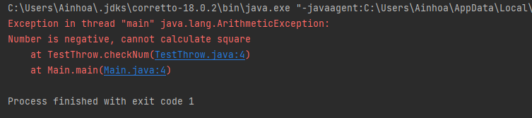

# Erarbeitung der Begriffen
 ***
 ## Exception Class
 Bei der Durchführung von Code in Java können verschiedene Probleme auftreten wie zum Beispiel: 
 + Programmierfehler durch den Entwickler
 + Fehler durch inkorrekte Inputs 
 + Andere unvorhergesehene Dinge

Wenn ein Fehler auftaucht, wird Java normalerweise angehalten und eine entsprechende Fehlermeldung angezeigt. Der Fachausdruck dafür lautet: Java wirft eine Exception (throw an error). Es gibt zwei Arte von Exception und zwar Checked Exceptions und unchecked Exceptions.

**Checked Exceptions**
Dies sind die Exceptions, die zur **Kompilierzeit** kontrolliert werden. Wenn ein Code innerhalb einer bestimmten Methode eine geprüfte Ausnahme verursacht, muss die Methode entweder die Exception behandeln oder sie muss die Exception mit dem Schlüsselwort throws definieren. Bei geprüften Exceptions gibt es zwei Typen: vollständig überprüfte und teilweise kontrollierte Exceptions. Eine vollständig geprüfte Exception ist eine geprüfte Exception, bei der alle untergeordneten Klassen ebenfalls geprüft werden, wie IOException, InterruptedException. Eine teilweise geprüfte Ausnahme ist eine geprüfte Ausnahme, bei der einige ihrer Unterklassen nicht geprüft sind, wie Exception.

**Unchecked Exceptions**
Diese Arten von Exceptions treten während der **Laufzeit** des Programms auf.  Dies sind die Exceptions, die bei der Kompilierung durch den Compiler nicht kontrolliert werden. In Java sind die Exceptions der Klassen Error und Runtime Exception ungeprüfte Exceptions, die durch schlechte Programmierarbeit entstehen.

#### try-catch-finally
**Java-try**
Mit der try-Anweisung kann ein Codeblock bestimmt werden, der während der Durchführung auf Fehler überprüft wird.

**Java-catch**
Mit der catch-Anweisung kann ein Codeabschnitt festgelegt werden, der ausgeführt wird, wenn im try-Block ein Fehler aufgetreten ist.

```
try {
  //  Block of code to try
}
catch(Exception e) {
  //  Block of code to handle errors
}
```
**Java-finally**
Man kann eine finally-Klausel an einen try-catch-Block anschliessen. Der Code innerhalb der finally-Klausel wird immer ausgeführt, auch wenn innerhalb des try- oder catch-Blocks eine Exception geworfen wird. Wenn Ihr Code eine Return-Anweisung innerhalb des Try- oder Catch-Blocks enthält, wird der Code innerhalb des finally-Blocks ausgeführt, bevor die Methode abgeschlossen wird. Unabhängig davon, ob innerhalb des try- oder catch-Blocks eine Exception geworfen wird oder nicht, wird der Code innerhalb des finally-Blocks ausgeführt. **Wichtig!** : Wenn innerhalb eines finally-Blocks eine Exception ausgelöst und nicht abgefangen wird, dann wird dieser finally-Block genauso unterbrochen wie der try- und catch-Block.

```
 } finally {
        if(reader != null){
            try {
  //  Block of code to try
}
catch(Exception e) {
  //  Block of code to handle errors
}
        }
```
#### Auslösen von Exceptions in Java
**Verwendung des Schlüsselworts Throw**
Das Java-Schlüsselwort **throw** wird benutzt, um eine Exception ausdrücklich im Code, innerhalb der Funktion oder des Codeblocks zu werfen. Mit dem Schlüsselwort throws können sowohl geprüfte als auch nicht geprüfte Exceptions definiert werden. Mit dem Schlüsselwort throws können jedoch nur geprüfte Exceptions übertragen werden. Throw wird innerhalb der Methode verwendet. Man darf jeweils nur eine Exception auslösen, d.h. es dürfen nicht mehrere Exceptions auftreten.

 Beispiel Code:
 ```
public class TestThrow {  
    //defining a method  
    public static void checkNum(int num) {  
        if (num < 1) {  
            throw new ArithmeticException("\nNumber is negative, cannot calculate square");  
        }  
        else {  
            System.out.println("Square of " + num + " is " + (num*num));  
        }  
    }  
    //main method  
    public static void main(String[] args) {  
            TestThrow obj = new TestThrow();  
            obj.checkNum(-3);  
            System.out.println("Rest of the code..");  
    }  
}  
```
output:




**Verwendung des Schlüsselworts Throws**
**Throws** ist ein Schlüsselwort, das darauf hinweist, dass diese Methode diese Art von Exception auslösen kann. Der Aufrufer muss die Exception mit einem try-catch-Block bearbeiten oder die Exception weiterleiten. Es können sowohl geprüfte als auch ungeprüfte Exceptions ausgelöst werden.
Mit dem throws-Schlüsselwort kann der Compiler beim Schreiben von Code helfen, der diese Art von Fehler behandelt, aber es verhindert nicht die anormale Beendigung des Programms. Das Schlüsselworts throws ermöglicht auch das dem Auftraggeber der Methode Informationen über die Arten von Exceptions geben, die die Methode auslösen könnte.

Beispiel Code:
 ```
public class TestThrows {  
    //defining a method  
    public static int divideNum(int m, int n) throws ArithmeticException {  
        int div = m / n;  
        return div;  
    }  
    //main method  
    public static void main(String[] args) {  
        TestThrows obj = new TestThrows();  
        try {  
            System.out.println(obj.divideNum(45, 0));  
        }  
        catch (ArithmeticException e){  
            System.out.println("\nNumber cannot be divided by 0");  
        }   
    }  
}     
```
output:


