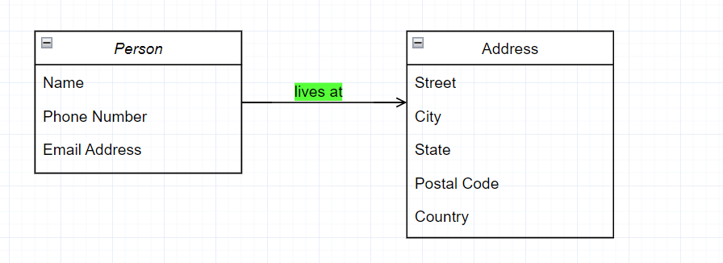
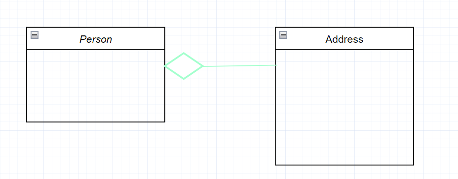
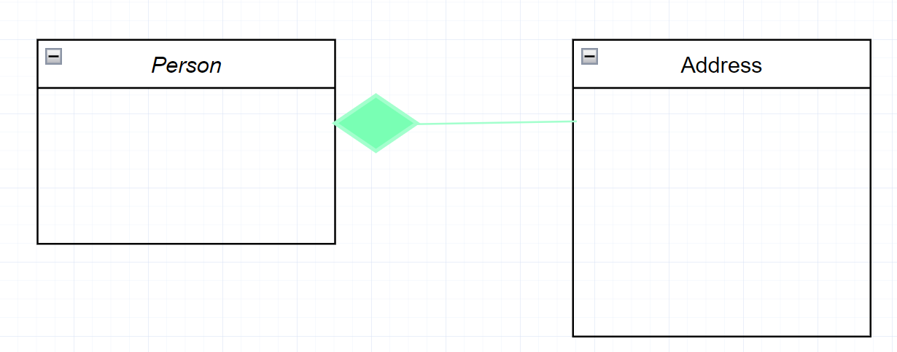

# Erarbeitung Inhalt und Begriffe
#### Hat-Beziehung (Assoziation)
Es gibt auch eine vereinfachte version von einer Assoziationen namens **Simple Association**. Assoziationen stellen Beziehungen zwischen Klassen in einem UML-Klassendiagramm da. Diese werden durch eine durchgezogene Linie zwischen Klassen dargestellt. Assoziationen werden in der Regel durch ein Verb oder eine Verbphrase bezeichnet, die den Problembereich der realen Arbeitswelt widerspiegelt.
##### Simple Association
- Eine strukturelle Beziehung zwischen zwei Peer-Klassen
- Es existiert eine Assoziation zwischen Klasse 1 und Klasse 2

Die untenstehende Darstellung enthält ein Beispiel für eine einfache Assoziation. Es gibt eine Assoziation, die die-Klasse Person und die Klasse Addresse miteinander verbindet. Die Beziehung wird als durchgezogene Linie dargestellt, die die beiden Klassen verbindet. Es enthält auch ein Verb in diesem Fall lives at.

#### Aggregation
Ist eine spezifische Art von Assoziationen. Sie repräsentiert eine "Teil von"-Beziehung. Klasse2 ist Teil von Klasse1. Viele Objekte (gekennzeichnet durch *) von Klasse2 können mit Klasse1 verknüpft werden. Die Objekte von Class1 und Class2 haben unterschiedliche Laufzeiten.

Das untere Diagramm zeigt ein Beispiel für eine Aggregation. Die Beziehung wird als durchgezogene Linie mit einer nicht ausgefüllten Raute am Ende der Verbindung dargestellt, die mit der Klasse, die das Aggregat darstellt, verbunden ist.

#### Komposition
Die Assoziation beschreibt eine existentielle is-part-of Beziehung, d.h. die Teile sind vom Ganzen abhängig (wenn der Baum stirbt, sterben auch dessen Blätter). Die zwei Klassen sind von einnader abhänig das heisst Klasse 1 ist abhänig von Klasse 2 die Klasse 1 kann nicht alleine stehen.

Das untere Diagramm zeigt ein Beispiel für eine Aggregation. Die Beziehung wird als durchgezogene Linie mit einer ausgefüllten Raute am Ende der Verbindung dargestellt, die mit der Klasse, die das Aggregat darstellt, verbunden ist.

